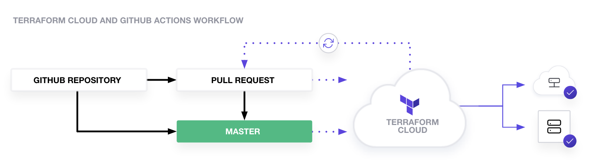

# Terraform CI/CD with Github Actions Workflow

https://learn.hashicorp.com/tutorials/terraform/github-actions

"Terraform with CI/CD enforces configuration best practices, promotes collaboration and automates the Terraform workflow."
"Terraform Cloud's built-in support for GitHub webhooks can accomplish this generic workflow."

## Needs
- A GitHub account
- A Terraform Cloud account
- An AWS account and AWS Access Credentials

## Workflow - update the main branch

1. Go to the Create a new Workspace page and select "API-driven workflow". 
2. Navigate to the "Actions" tab and enable this pre-configured workflow by clicking "I understand my workflows, go ahead and enable them." 
3. modify Terraform configuration on feature branch.
4. Create and merge a pull request.

